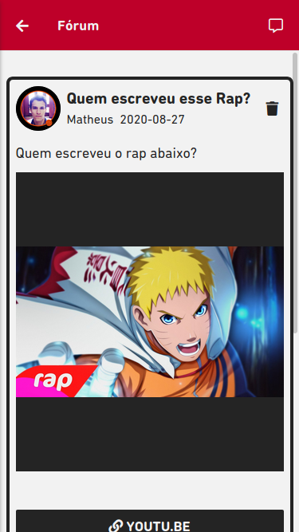

## Nihongo Idioms React Native Frontend

> 👷 Developed by Matheus Ramalho de Oliveira.  
🔨 Systems Analyst, Full-Stack Developer.  
🏡 Goiânia, Goiás, Brasil.  
✉️ kastorcode@gmail.com  
👍 [instagram.com/kastorcode](https://www.instagram.com/kastorcode)

---

  

    Platform for learning languages through spaced repetition, explanatory modules, combined text and audio, question forum, notification system, premium account, and other settings more.

---

### 🖼️ Screenshots

   
  

   
  

   
  

   
  

   
  

   
  

   
  

   
  

   
  

   
  

   
  

   
  

   
  

  

---

### 👉 Used technologies

- [XAMPP](https://www.apachefriends.org)
- [MySQL](https://www.mysql.com)
- [PHP](https://www.php.net)
- [Expo](https://expo.dev)
- [React Native](https://reactnative.dev)

---

### 📜 Installation and execution

1. Make a clone of this repository;
2. Enter the folder running `cd nihongo-idioms-frontend-react-native`;
3. Run `yarn` to install dependencies;
4. Run `yarn web` to start the web development server;
5. Open the address `https://localhost:19006` in the browser;
6. Run `yarn start` to start the mobile development server;
7. Run `yarn android` or `yarn ios` depending on the operating system;
8. The iOS version has not been tested;
9. Make sure you have the [backend](https://github.com/kastorcode/nihongo-idioms-backend-php) running.

---

### 🔙 🔚 Project backend

[nihongo-idioms-backend-php](https://github.com/kastorcode/nihongo-idioms-backend-php)
